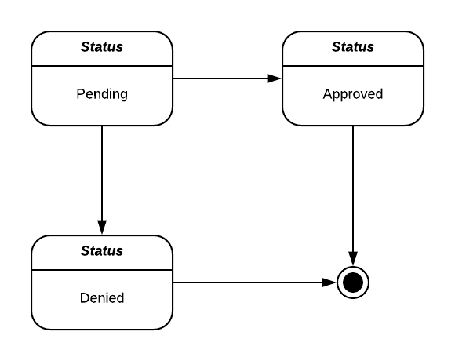
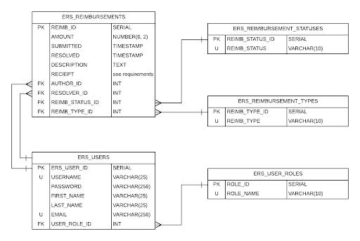
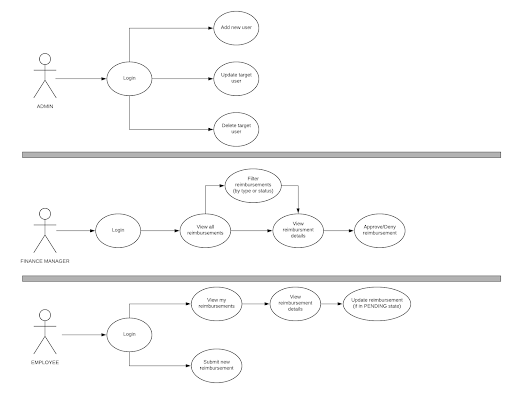

This project was bootstrapped with [Create React App](https://github.com/facebook/create-react-app).

## Available Scripts

In the project directory, you can run:

### `npm start`

Runs the app in the development mode. 
Open [http://localhost:3000](http://localhost:3000) to view it in the browser.

The page will reload if you make edits. 
You will also see any lint errors in the console.

<<<<<<< Updated upstream

=======
### `npm test`
>>>>>>> Stashed changes

Launches the test runner in the interactive watch mode. 
See the section about [running tests](https://facebook.github.io/create-react-app/docs/running-tests) for more information.

### `npm run build`

Builds the app for production to the `build` folder. 
It correctly bundles React in production mode and optimizes the build for the best performance.

The build is minified and the filenames include the hashes. 
Your app is ready to be deployed!

See the section about [deployment](https://facebook.github.io/create-react-app/docs/deployment) for more information.

<<<<<<< Updated upstream

=======
### `npm run eject`
>>>>>>> Stashed changes

**Note: this is a one-way operation. Once you `eject`, you can’t go back!**

If you aren’t satisfied with the build tool and configuration choices, you can `eject` at any time. This command will remove the single build dependency from your project.

Instead, it will copy all the configuration files and the transitive dependencies (webpack, Babel, ESLint, etc) right into your project so you have full control over them. All of the commands except `eject` will still work, but they will point to the copied scripts so you can tweak them. At this point you’re on your own.

You don’t have to ever use `eject`. The curated feature set is suitable for small and middle deployments, and you shouldn’t feel obligated to use this feature. However we understand that this tool wouldn’t be useful if you couldn’t customize it when you are ready for it.

## Learn More

You can learn more in the [Create React App documentation](https://facebook.github.io/create-react-app/docs/getting-started).

<<<<<<< Updated upstream
		ERS Use Case Diagram

		Technical Requirements

- Persistence Tier
	PostGreSQL
	AWS Simple Storage Service (optional for receipt image storage)

- Application Tier
	Environment: NodeJS
	Language: TypeScript
	Web Framework: Express
	Authentication Strategy (choose one): 
	Server-side session management with express-session
	Client-side session management with JWTs

- Client Tier
	Environment: Browser
	Language(s): HTML, CSS, and either JS or TS
	Styling Framework: Bootstrap

	Non-Functional Requirements

- Persistence Tier
	Database is deployed to an AWS RDS instance
	The provided relational model is adhered to
	If AWS S3 is leverage the bucket must be properly secured

- Application Tier
	API is deployed to an AWS EC2 instance
	API leverages a web request logging framework
	All methods are properly documented
	Entire application has a minimum of 80% unit test coverage
	(Optional) API leverages a general purpose logging framework
	(Optional) All passwords are hashed before being stored in the data source

- Client Tier
	UI is deployed to an AWS S3 bucket configured for static web hosting
(Optional) UI is implemented with React

- Operations Layer
	Development workflow will be augmented by a CI/CD pipeline

=======
To learn React, check out the [React documentation](https://reactjs.org/).
>>>>>>> Stashed changes
